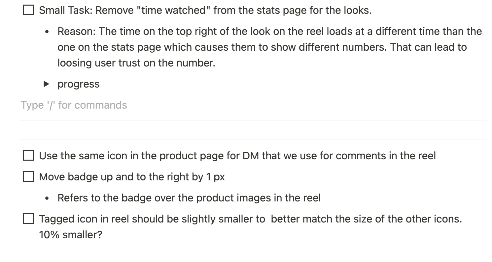
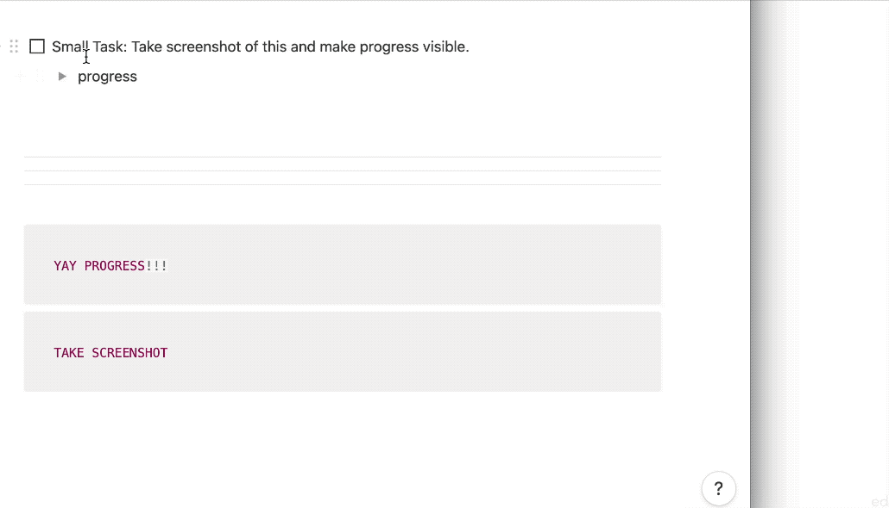

|  | 
|:--:| 
| *Tasks getting checked off the task list on the scrum board* |

A [Scrum Board](http://scrumbook.org/value-stream/information-radiator/scrum-board.html) is next pattern in the work synchronization sequence following [Information Radiator](/agile-in-action-information-radiator).

For context, I am the only iOS front-end developer contributing the vast majority of the output. This makes pulling in work easier than trying to split up the work between multiple developers. If there's iOS work, there's the one guy, me, to ask to do it. We are not quite a [Cross Fucntional Team](http://scrumbook.org/product-organization-pattern-language/development-team/cross-functional-team.html) yet. This article addresses daily challenges that come with generating and maintaining a [Sprint Backlog](http://scrumbook.org/value-stream/sprint-backlog.html).

### Generating the tasks on the board

|  | 
|:--:| 
| *Each day starts fresh with a [Sprint Goal](http://scrumbook.org/value-stream/sprint-goal.html)* |

 Most of the time, the goal originates from the [Product Owner](http://scrumbook.org.datasenter.no/product-organization-pattern-language/product-owner.html) but in the case that a [PBI](http://scrumbook.org.datasenter.no/value-stream/product-backlog/product-backlog-item.html) is not pulled in, an item from [Impediment List](http://scrumbook.org.datasenter.no/retrospective-pattern-language/impediment-list.html) is pulled in, instead.

During the [Daily Scrum](http://scrumbook.org/value-stream/sprint/daily-scrum.html), the goal is broken down into tasks, a.k.a. [Sprint Backlog Items](http://scrumbook.org/value-stream/sprint-backlog/sprint-backlog-item.html).

|  | 
|:--:| 
| *A front-end UI building task* |

There's a big task, a row of buttons and their expected behaviors. It's broken down into its constituents which are all check-off-able. The [Definition of Done](http://scrumbook.org/value-stream/definition-of-done.html) here is that it's QA-ready; it works most of the time, for the happy paths. A collapsible toggle list includes a Figma link that refers to the design. We used to post a static image, but designs were prone to change mid-day and those updates would be incorporated into the notion doc close to real-time. 

### Estimating and making commitments

|  | 
|:--:| 
| *Tasks committed vs. tasks requested* |

Not all tasks are equally important. The tasks that are relevant to achieving the goal are prioritized at the start, but they aren't the only tasks. More stuff to do comes up during the day, and they're treated as requests to be handled. I denote two distinct sections of the board: above the three separators and the ones below. Others propose tasks by inserting checkbox items after the three separators. Once I understand them, I can drag them up above the three separators to commit to the tasks. This self-commitment instead of others committing on my behalf is an application of [Pigs Estimate](http://scrumbook.org/value-stream/estimation-points/pigs-estimate.html).

### Doing work and making progress

|  | 
|:--:| 
| *Taking progress pics* |

On a mac, the shortcut for taking a screenshot of a part of the screen is `Command + Shift + 4`. Using the left hand, it only takes two seconds. Once that screenshot is staged on the bottom-right of the screen, it can simply be dragged into Notion. Using a drop-down toggle, I can store evidence of my work. The bigger benefit here, when it comes to subjective matters such as UI design, is that the designer can quickly comment on the pixels on screen as soon as they're built. There's no need to wait around for a staging build to come around their way so that they can compile a whole another list of complaints.

### Getting stuck and unstuck

|  | 
|:--:| 
| *Impediments* |

Sometimes tasks are dependent on someone else's work, or are impeded by a lack of understanding. I might not have all the pieces, or the spec is too ambiguous for an educated guess. When that happens, I insert what I need to continue work under that task, and turn it into a Callout. Callouts are louder than regular text, and include an emoji. The perfect emoji for impediments is a 🚧. Because the scrum board is visible and often checked, it gets noticed and resolved quickly 👌. Compared to an Impediment List, callouts are more contextual and represent smaller scopes.

When all the checkboxes are filled at the end of the work day, we do a small [Retrospective](http://scrumbook.org/value-stream/sprint/sprint-retrospective.html) to share how we felt, and how we can improve. It feels great to overcome challenges. I get a dopamine high from checking off those little boxes.

### Doing it

I'm happy to share the lessons I learned while using a scrum board. Even if I was to go back to work on-site, I'd continue to use this living doc. It's quick to update, easy to sync, easy to share. If you want to copy some of these techniques, I must warn you to take it [One step at a time](http://scrumbook.org.datasenter.no/retrospective-pattern-language/one-step-at-a-time.html). And especially don't try to force someone outside your [Community of Trust](http://scrumbook.org.datasenter.no/external-patterns/community-of-trust.html) to implement it, either.

As I continue to improve, I hope to come back here and make meaningful updates. Thanks for reading!

