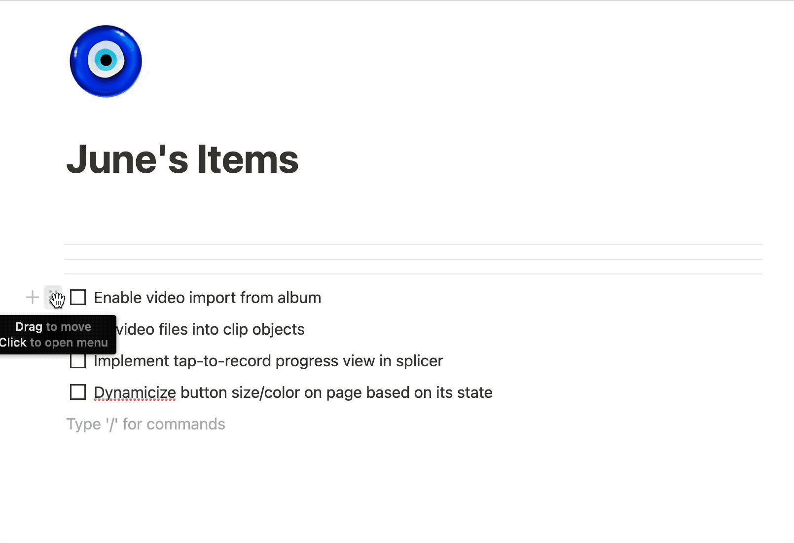

Interruptions suck, so you made an [Information Radiator](http://scrumbook.org/value-stream/information-radiator.html) where teammates don't have to sync up every status inquiry. This information radiator shows what everyone's working on, but how are you showing what each individual is working on? When the team is swarming on a [Sprint Backlog](http://scrumbook.org/value-stream/sprint-backlog.html), not everyone is working on the exact same [SBI](http://scrumbook.org/value-stream/sprint-backlog/sprint-backlog-item.html). Individual developers pull an item to work on, either together or alone. These items have states, such as TODO, WIP, or Done. How should these states be handled? How do you show the list of tasks? Its estimate? Its WIP status? And who's commited to doing them?

In Jira or similar bug-tracking system, each item is shown as "tickets", where each ticket has a drop-down menu to specify state, an assigner, the do-er, its estimate, and a comment section that follows. But what if it takes just as long to file a bug and maintain it, as it is to do the thing itself? Why bother with all that overhead? In a traditional co-located information radiator, sticky notes carry that information via its location and who touched it last.

Generating the list entails estimating its effort in [Sprint Planning](http://scrumbook.org/value-stream/sprint-planning.html). It's much more than assigning story points associated with each task. And what about bugfixes and removing impediments that aren't worth a whole point? Where does that status go on the information radiator? When estimating, the points are useful to the extent that they add up to [Yesterday's Weather](http://scrumbook.org/value-stream/estimation-points/yesterday-s-weather.html) for forecasting. Will this emergent task fit into the timebox? 

If the developer wasn't involved in coming up with the task, then assigning that task is a hand-off. Hand-offs are a source of ambiguity, and a cause for rework or overproduction. At the scale of a check-offable item, the words as they are written should serve as pointers to the task to be done, instead of being the source of truth. It often takes longer to describe the task than to do the task, so why bother writing it down? What a waste! 

So that's a lot of complaining about sharing some TODOs on a list. What am I suggesting, then? 

When displaying [Small Items](http://scrumbook.org/value-stream/sprint-planning.html) on the Scrum Board, split the items into two sections: tasks above the line that the developer is committed to for the timebox, and tasks below that are not.

When re-planning a Sprint at the Daily Standup, an SBI breaks down into smaller items at the finest level of [Granularity Gradient](http://scrumbook.org/value-stream/product-backlog/granularity-gradient.html). At that point, its done-ness is more obvious, so it can be checked off. It goes below the line. If the developer commits to it, then it gets dragged above the line. 

Tasks above the line doesn't mean it will be taken to completion, because there's always unknowns. Rather, it shows exactly what the developer is focused on, and what they've got coming up next. This list would update frequently, to address routine questions such as 'Is this done yet?', 'What are you working on now?', 'Can we go over this item later?'

